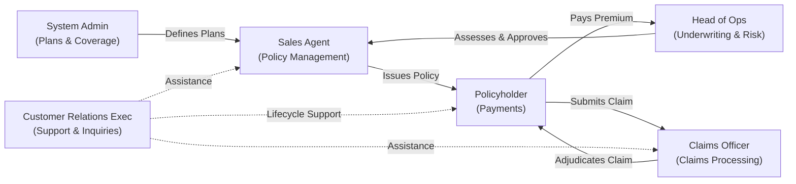

# MediSure Lanka Insurance PLC - Health Insurance Management System (HIMS)

**Module:** SE2030 Software Engineering Group Project  
**Group ID:** `2026-Y2-S1-MLB-B5G2-02`  
**System:** Health Insurance Management System (HIMS)  

---

## Finalized Six Major Functions

### 1. Policy Management
- **Assigned Member:** Lankadhikara L.R.M.M.P. (`IT25101639`)
- **Owner Persona:** Insurance Sales Agent
- **Core Entity:** Policy
- **CRUD Operations:**
  - **Create:** Issue new policy
  - **Read:** View policy details / list
  - **Update:** Modify coverage / renew
  - **Delete:** Cancel / terminate policy
- **GitHub Email:** `IT25101639@my.sliit.lk`

---

### 2. Claims Management
- **Assigned Member:** Gunasinghe N.M. (`IT25101773`)
- **Owner Persona:** Senior Claims Processing Officer
- **Core Entity:** Claim
- **CRUD Operations:**
  - **Create:** Submit new claim
  - **Read:** View claim status / history
  - **Update:** Change status (approve / reject)
  - **Delete:** Withdraw / void claim
- **GitHub Email:** `IT25101773@my.sliit.lk`

---

### 3. Underwriting & Risk Assessment
- **Assigned Member:** De Zoysa A.I. (`IT25102600`)
- **Owner Persona:** Head of Health Insurance Operations
- **Core Entity:** Underwriting Application
- **CRUD Operations:**
  - **Create:** Submit application for review
  - **Read:** View risk score / assessment
  - **Update:** Update decision & premium
  - **Delete:** Reject / withdraw application
- **GitHub Email:** `IT25102600@my.sliit.lk`

---

### 4. Premium & Payment Management
- **Assigned Member:** Ramanayaka U.K.D. (`IT25100714`)
- **Owner Persona:** Policyholder (new persona)
- **Core Entity:** Payment
- **CRUD Operations:**
  - **Create:** Make a premium payment
  - **Read:** View payment history / receipts
  - **Update:** Change auto-pay / payment method
  - **Delete:** Cancel / refund a payment
- **GitHub Email:** `IT25100714@my.sliit.lk`

---

### 5. Benefits & Coverage Plan Management
- **Assigned Member:** Karunarathna W.M.K.U. (`IT25103657`)
- **Owner Persona:** System Administration Manager
- **Core Entity:** Insurance Plan
- **CRUD Operations:**
  - **Create:** Create new plan / package
  - **Read:** View available plans & coverage
  - **Update:** Update premium rates / coverage limits
  - **Delete:** Discontinue a plan
- **GitHub Email:** `IT25103657@my.sliit.lk`

---

### 6. Customer Support & Inquiry Management
- **Assigned Member:** Kavisekara K.M.H.N. (`IT25103510`)
- **Owner Persona:** Customer Relations Executive
- **Core Entity:** Support Ticket
- **CRUD Operations:**
  - **Create:** Log new inquiry
  - **Read:** View ticket details / history
  - **Update:** Respond / update status
  - **Delete:** Close / delete resolved ticket
- **GitHub Email:** `IT25103510@my.sliit.lk`

---

## Member Assignment Summary Table

| # | Function Area | Member Name | Student ID | Owner Persona | Core Entity | GitHub Email |
|---|---|---|---|---|---|---|
| 1 | Policy Management | Lankadhikara L.R.M.M.P. | `IT25101639` | Insurance Sales Agent | Policy | `IT25101639@my.sliit.lk` |
| 2 | Claims Management | Gunasinghe N.M. | `IT25101773` | Senior Claims Processing Officer | Claim | `IT25101773@my.sliit.lk` |
| 3 | Underwriting & Risk Assessment | De Zoysa A.I. | `IT25102600` | Head of Health Insurance Operations | Underwriting Application | `IT25102600@my.sliit.lk` |
| 4 | Premium & Payment Management | Ramanayaka U.K.D. | `IT25100714` | Policyholder | Payment | `IT25100714@my.sliit.lk` |
| 5 | Benefits & Coverage Plan Management | Karunarathna W.M.K.U. | `IT25103657` | System Administration Manager | Insurance Plan | `IT25103657@my.sliit.lk` |
| 6 | Customer Support & Inquiry Management | Kavisekara K.M.H.N. | `IT25103510` | Customer Relations Executive | Support Ticket | `IT25103510@my.sliit.lk` |

---

## System Flow Narrative

> **Admin** defines coverage plans  
> ➔ **Sales Agent** issues policies from those plans  
> ➔ **Policyholder** pays premiums  
> ➔ **Claims Officer** processes claims against the policy  
> ➔ **Head of Ops** underwrites risk  
> ➔ **CRE** handles customer support throughout the lifecycle.

