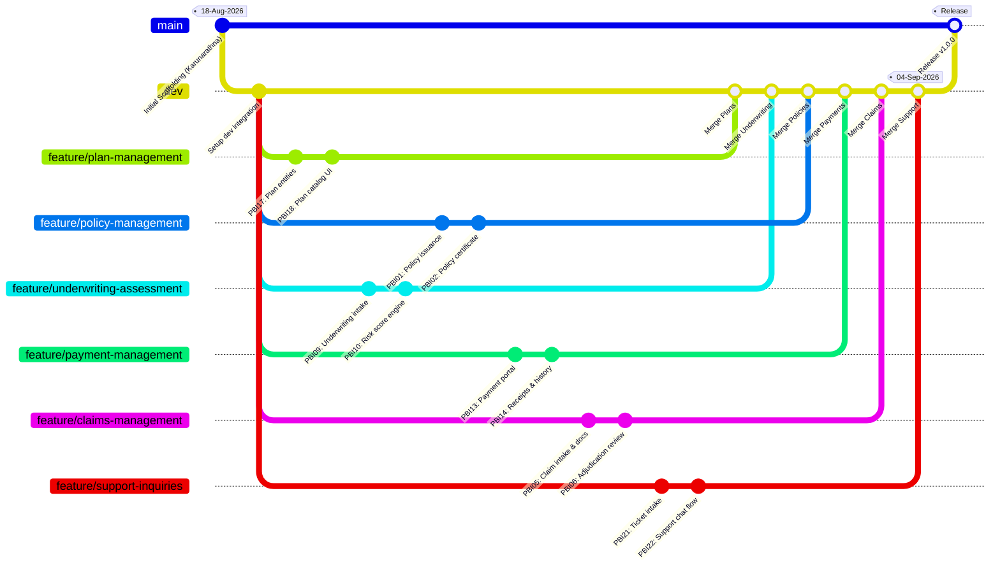

# MediSure Lanka Insurance PLC — Health Insurance Management System (HIMS)

[](https://www.sliit.lk)
[](#)
[](#)
[](#)
[](#)

A comprehensive enterprise health insurance management web application developed for **MediSure Lanka Insurance PLC** as part of the **SE2030 Software Engineering** course at SLIIT.

---

## 👥 Project Team & Functional Allocations

| # | Team Member | Student ID | Scrum Role | Major Function | Owner Persona | GitHub Email |
|:-:|:---|:---:|:---|:---|:---|:---|
| 1 | **Lankadhikara L.R.M.M.P.** | `IT25101639` | Product Owner / Dev | Policy Management | Insurance Sales Agent | `IT25101639@my.sliit.lk` |
| 2 | **Gunasinghe N.M.** | `IT25101773` | Developer | Claims Management | Senior Claims Processing Officer | `IT25101773@my.sliit.lk` |
| 3 | **De Zoysa A.I.** | `IT25102600` | Developer | Underwriting & Risk Assessment | Head of Health Insurance Operations | `IT25102600@my.sliit.lk` |
| 4 | **Ramanayaka U.K.D.** | `IT25100714` | Developer | Premium & Payment Management | Policyholder | `IT25100714@my.sliit.lk` |
| 5 | **Karunarathna W.M.K.U.** | `IT25103657` | Scrum Master / Dev | Benefits & Coverage Plan Mgmt | System Administration Manager | `IT25103657@my.sliit.lk` |
| 6 | **Kavisekara K.M.H.N.** | `IT25103510` | Developer | Customer Support & Inquiry Mgmt | Customer Relations Executive | `IT25103510@my.sliit.lk` |

---

## ⚙️ Environment Configuration & Credential Safety

> [!IMPORTANT]
> To comply with security best practices, sensitive configuration files (`src/main/resources/application.yml` and `.env`) are **excluded from Git tracking** via `.gitignore`. Never commit database passwords or secret keys to version control.

### Setting Up Local Credentials:

1. **Option 1: Using `application.yml` (Recommended for Local Dev)**
   - Copy the example configuration file:
     ```bash
     cp src/main/resources/application.yml.example src/main/resources/application.yml
     ```
   - Open `src/main/resources/application.yml` in your editor and update the MySQL credentials:
     ```yaml
     spring:
       datasource:
         username: root
         password: your_local_mysql_password
     ```

2. **Option 2: Using Environment Variables / `.env`**
   - Copy `.env.example`:
     ```bash
     cp .env.example .env
     ```
   - Set `DB_USERNAME` and `DB_PASSWORD` in your local environment.

---

## 🌿 Git Branching Strategy & Workflow

The repository follows a Gitflow-inspired structure designed for collaborative team development:



### Branches:
- **`main`**: Production-ready, stable codebase.
- **`dev`**: Main development integration branch where all feature branches merge.
- **`feature/*`**: Dedicated branches for each member:
  - `feature/plan-management` (`IT25103657@my.sliit.lk`)
  - `feature/policy-management` (`IT25101639@my.sliit.lk`)
  - `feature/underwriting-assessment` (`IT25102600@my.sliit.lk`)
  - `feature/payment-management` (`IT25100714@my.sliit.lk`)
  - `feature/claims-management` (`IT25101773@my.sliit.lk`)
  - `feature/support-inquiries` (`IT25103510@my.sliit.lk`)

---

## 📚 Documentation Reference

- **[Project Specification](file:///F:/repos/hims-portal/PROJECT_SPECIFICATION.md)**: Detailed breakdown of the 6 major functions, CRUD operations, entity models, and persona mappings.
- **[Scrum Report (Lab 02)](file:///F:/repos/hims-portal/SCRUM_REPORT.md)**: Complete 4-sprint plan, 24 user stories (PBI01 to PBI24), task estimation breakdowns, and sprint goals.
- **Activity Diagrams (Lab 04)**: Found in `MediSure activity diagrams Lab04.pdf`, covering the UML activity diagrams for all six system processes.

---

## 🚀 Running the Application

### Prerequisites:
- Java JDK 17+
- MySQL Server 8.0+
- Maven 3.8+

### Steps:
1. Ensure MySQL is running on `localhost:3306`.
2. Create the database:
   ```sql
   CREATE DATABASE IF NOT EXISTS hims_db;
   ```
3. Set your credentials in `src/main/resources/application.yml` (copied from `application.yml.example`).
4. Build and run:
   ```bash
   mvn clean spring-boot:run
   ```
5. Access the application in your browser at `http://localhost:8080`.
6. Demo credentials for all seeded accounts: `password123`.
